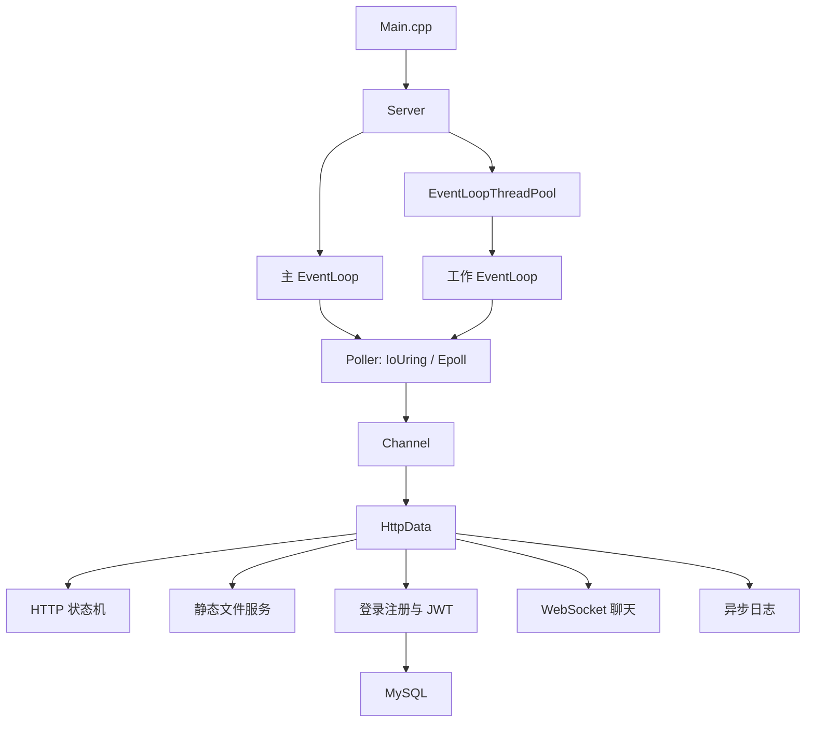

# httpServer

一个基于 C++17、Linux Socket、`io_uring` 和多线程事件循环实现的轻量级 HTTP/WebSocket 服务器。项目包含静态文件服务、JSON 登录注册接口、JWT 鉴权、WebSocket 聊天原型以及异步日志组件。

> 当前项目处于学习和持续重构阶段，主要面向 Linux 环境。聊天室和 MySQL 功能需要额外完成数据库初始化及接口联调，不建议直接用于生产环境。

## 功能特性

- 基于 TCP Socket 的 HTTP/1.0、HTTP/1.1 请求处理。
- 可切换 `io_uring` / `epoll` 的事件后端，支持公平的端到端基准对比。
- 主事件循环 + 工作线程事件循环池的并发模型。
- HTTP 请求行、请求头和请求体的状态机解析。
- `wwwroot` 静态文件服务和 MIME 类型识别。
- Keep-Alive、连接超时和定时器管理。
- WebSocket 握手、客户端掩码帧解析和文本消息广播。
- 基于 OpenSSL HMAC-SHA256 的 JWT 生成与校验。
- 基于 MySQL client 的用户注册和登录接口。
- 基于双缓冲的异步日志系统。
- `ChainBuffer`、内存池和 `HttpData` 对象池等基础组件。
- 内置 HTTP 请求示例和日志压力测试代码。

## 架构概览



服务器启动一个主事件循环接收新连接，再将连接按轮询方式分配给工作线程中的事件循环。`IoUring` 负责提交 poll、异步 read/write 请求，并通过 `Channel` 回调连接对象 `HttpData`。

## 环境要求

- Linux，建议 Ubuntu 22.04 或更新版本。
- 支持 `io_uring` 的 Linux 内核以及 `liburing`。
- CMake 3.21 或更新版本。
- GCC/Clang，C++17。
- OpenSSL 开发库。
- MySQL client 开发库。

在 Ubuntu 中安装主要依赖：

```bash
sudo apt update
sudo apt install -y build-essential cmake pkg-config liburing-dev libssl-dev default-libmysqlclient-dev
```

## 编译

项目使用 CMake Presets，所有构建产物都位于 `build/`，不会污染源码目录：

> 建议将仓库 clone 到 WSL 的 Linux 文件系统后构建，例如 `~/code/httpServer`。若源码位于 `/mnt/c`，请参阅 [构建与测试](docs/Build_and_Test.md) 中的临时构建方式。

```bash
git clone https://github.com/hhhwyg/httpServer.git
cd httpServer

cmake --preset release
cmake --build --preset release --parallel
```

编译成功后，可执行文件位于：

```text
build/release/WebServer
```

日常开发请使用 `debug` 预设并执行自动测试：

```bash
cmake --preset debug
cmake --build --preset debug --parallel
ctest --preset debug
```

完整的构建、Sanitizer 和可选示例说明见 [构建与测试](docs/Build_and_Test.md)。

## 启动服务器

请从项目根目录启动，这样静态文件路径 `./wwwroot` 可以正确解析：

```bash
./build/release/WebServer
```

默认参数：

| 参数 | 默认值 | 说明 |
| --- | --- | --- |
| `-t` | `6` | 工作线程数量 |
| `-p` | `8088` | 监听端口 |
| `-l` | `./WebServer.log` | 日志文件路径；使用 `-l` 时应传入绝对路径 |
| `-b` | `uring` | I/O 后端：`uring`（或 `io_uring`）/ `epoll` |

示例：

```bash
./build/release/WebServer -b epoll -t 4 -p 8088 -l /tmp/httpServer.log
```

打开静态首页：

```text
http://127.0.0.1:8088/
```

健康检查：

```bash
curl http://127.0.0.1:8088/ping
```

预期返回：

```text
OK
```

## HTTP 接口

### 静态文件

```http
GET /
GET /<file>
HEAD /<file>
```

文件从项目根目录下的 `wwwroot/` 读取，`/` 对应 `wwwroot/index.html`。

### 用户注册

```http
POST /register
Content-Type: application/json

{"username":"alice","password":"password"}
```

### 用户登录

```http
POST /login
Content-Type: application/json

{"username":"alice","password":"password"}
```

登录成功后返回 JWT，前端会将它作为 WebSocket 握手 URL 的 `token` 参数发送。

### WebSocket

```text
ws://127.0.0.1:8088/ws?token=<JWT>
```

服务器会校验 JWT，并处理文本帧中的 JSON 消息。当前后端聊天消息格式使用字符串类型的 `roomId` 和 `content`，例如：

```json
{"type":"join","roomId":"10000001"}
```

```json
{"type":"chat","roomId":"10000001","content":"你好"}
```

## MySQL 配置

登录和注册代码依赖 MySQL 表 `user`，但 `src/Main.cpp` 中的连接池初始化调用目前被注释掉。启用账号功能前，需要：

1. 创建数据库和用户表。
2. 按实际环境修改 `src/Main.cpp` 中的 `SqlConnPool::Instance()->Init(...)`。
3. 重新编译并启动服务器。

示例表结构：

```sql
CREATE DATABASE webserver CHARACTER SET utf8mb4 COLLATE utf8mb4_unicode_ci;
USE webserver;

CREATE TABLE user (
    id INT PRIMARY KEY AUTO_INCREMENT,
    username VARCHAR(64) NOT NULL UNIQUE,
    passwd VARCHAR(255) NOT NULL
);
```

示例初始化调用：

```cpp
SqlConnPool::Instance()->Init(
    "127.0.0.1", 3306, "root", "your-password", "webserver", 12);
```

## 测试与示例

### HTTP 客户端示例

`tests/HTTPClient.cpp` 是一个简单的 Socket 客户端示例，内部默认连接 `127.0.0.1:8888`。如需使用它，请让服务器监听 `8888`：

```bash
cmake --preset debug -DHTTPSERVER_BUILD_EXAMPLES=ON
cmake --build build/debug --target HTTPClient --parallel
./build/debug/WebServer -p 8888
./build/debug/HTTPClient
```

### 日志压力测试

`tests/base/LoggingTest.cpp` 用于验证日志格式化、单线程写入和多线程写入：

```bash
cmake --preset debug -DHTTPSERVER_BUILD_MANUAL_TESTS=ON
cmake --build build/debug --target LoggingStressTest --parallel
./build/debug/tests/LoggingStressTest
```

`base.object_pool`、`base.uring_operation_registry`、`base.poller_backend` 和 `httpdata.lifecycle` 已接入 CTest。日志程序是高输出量压力测试，仍需手动执行；后续阶段会继续补充协议和连接生命周期的自动测试。

## 目录结构

```text
.
├── CMakeLists.txt              # CMake 构建配置
├── src/
│   ├── Main.cpp                # 程序入口和命令行参数
│   ├── IoUring.*               # io_uring 事件/异步 I/O 封装
│   ├── base/                   # 线程、锁、缓冲区和日志基础组件
│   ├── channel/                # Channel 事件回调封装
│   ├── chat/                   # 聊天室、用户和房间控制器
│   ├── epoll/                  # 传统 epoll 实现，当前主流程使用 IoUring
│   ├── eventloop/              # EventLoop 和 EventLoopThreadPool
│   ├── httpdata/               # HTTP 解析、静态文件和 WebSocket 处理
│   ├── server/                 # 监听 Socket 和新连接分发
│   ├── sql/                    # MySQL 连接池和 RAII 连接管理
│   ├── thread/                 # 旧版线程池实现，当前未被主流程使用
│   ├── timer/                  # 连接超时定时器
│   └── util/                   # Socket、缓冲区和加密辅助函数
├── third_party/json.hpp        # nlohmann/json 单头文件库
├── wwwroot/index.html          # 聊天室前端页面
├── tests/                      # 手动编译的示例和压力测试
├── scripts/                    # 源码改写和重构辅助脚本
├── docs/                       # 设计说明和代码审查文档
└── logs/                       # 已保存的运行日志
```

## 当前已知限制

- 项目依赖 Linux 专有接口 `io_uring`、`epoll`、`eventfd` 和 `sendfile`，不能直接在原生 Windows 环境编译运行。
- MySQL 连接池初始化仍是注释状态；未配置数据库时，登录和注册不能正常工作。
- 房间接口代码仍在联调中，`analysisRequest()` 使用的 `path_` 当前没有在 URI 解析流程中赋值，`/room/create` 和 `/room/list` 需要进一步修正路由匹配。
- `wwwroot/index.html` 与后端当前 WebSocket JSON 字段存在不一致，前端发送的是 `user`/`msg`，后端解析的是 `roomId`/`content`，需要统一协议。
- JWT 签名密钥目前硬编码为 `my_secret_key`，上线前必须改为外部配置并妥善保管。
- 用户密码当前以明文写入数据库，生产环境应使用带盐密码哈希，并使用参数化 SQL 防止注入。
- 静态文件路径、请求体大小、WebSocket 控制帧和异常处理仍需要更完整的安全边界与协议校验。
- 日志文件轮转接口尚未实现，运行时应自行管理日志文件大小和保存周期。

## 相关文档

- [日志系统设计](docs/Log的设计.txt)
- [重构路线图](docs/Refactoring_Roadmap.md)
- [构建与测试](docs/Build_and_Test.md)
- [开发指南](docs/Development_Guide.md)
- [持续集成](docs/CI.md)
- [连接生命周期](docs/Connection_Lifecycle.md)
- [io_uring I/O 设计](docs/IoUring_Design.md)
- [可切换 Poller 与性能对比](docs/Poller_Backends.md)

## 许可证

当前仓库尚未声明开源许可证。除非仓库作者补充许可证文件，否则请不要默认代码可以用于再发布或商业用途。
